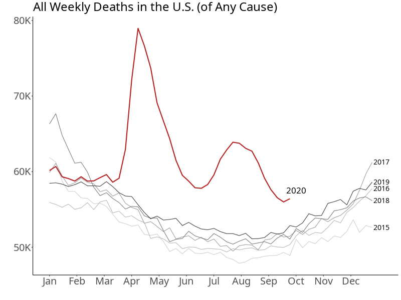

```{r falcon-tell-mug-setup, include = FALSE}
library(etude)
library(learnr)
library(gradethis)

knitr::opts_chunk$set(echo = FALSE)
learnr::tutorial_options(exercise.timelimit = 60, 
                 exercise.checker = gradethis::grade_learnr)
```


`r etude::exercise_title()` The following graphic was produced based on data from the [US Centers for Disease Control](https://www.cdc.gov/nchs/nvss/vsrr/covid19/excess_deaths.htm) in early December 2020. It shows deaths as a function of time of year.

```{r echo=FALSE}
image <- "images/US-deaths.png"
image <- "images/QALYS.png"
nm <- system.file(image, package="math141Zexercises")
success <- file.copy(from = nm, image)
knitr::include_graphics(image)
```




```{r falcon-tell-mug-Essay1, echo=FALSE, eval=FALSE}
etude::essay_response(
  prompt = "Based on the graph, estimate how many deaths are their annually in the US in a 'typical' year? Explain briefly how you constructed your estimate."
)
```

